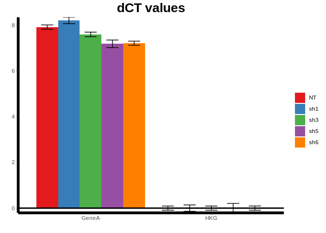
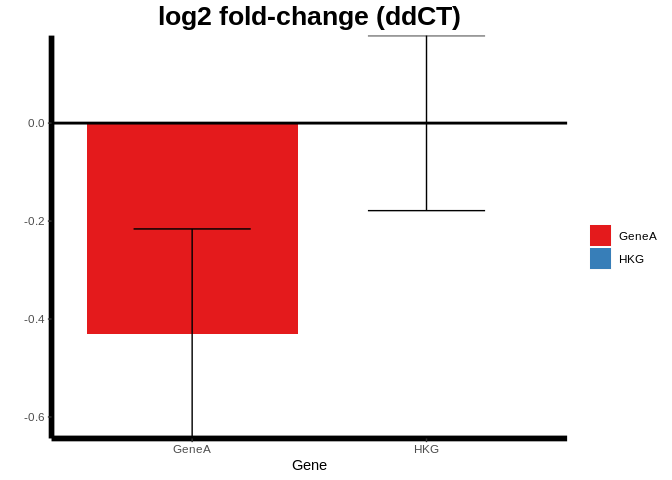
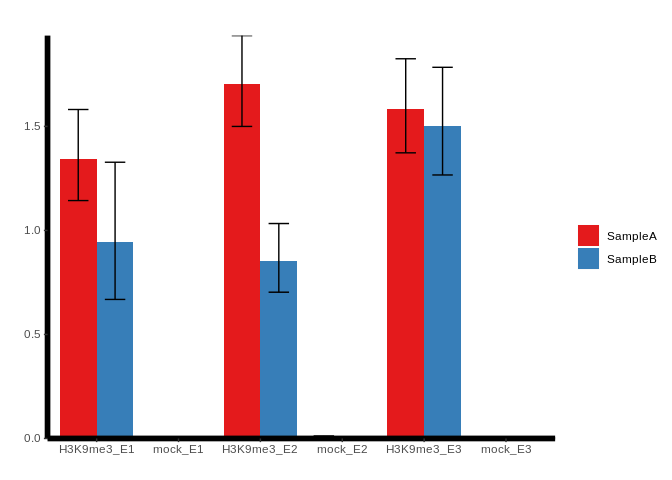
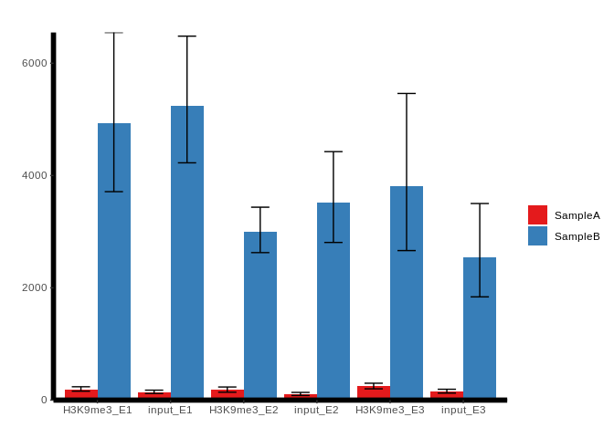
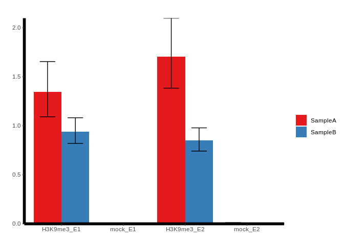
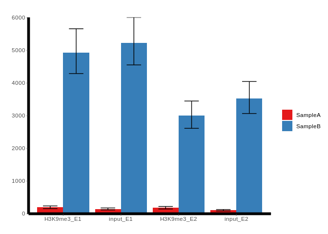

<!-- README.md is generated from README.Rmd. Please edit that file -->
WARPqpcr
========


<!-- badges: start -->
[](https://travis-ci.org/sccallahan/WARPqpcr)

[](https://zenodo.org/badge/latestdoi/222321107) <!-- badges: end -->

**W**eb **A**pp and **R** **P**ackage for qPCR (WARPqpcr) provides functionality for analyzing RT-qPCR and ChIP-qPCR data and generating plots of results.

The goal of this package is to allow rapid, reproducible analysis of qPCR data, particularly in the molecular biology setting, to provide easy functions for visualizing results, and to provide a tool for selecting the best housekeeping gene from a list of candidates. Many of the functions in this package use ReadqPCR and NormqPCR packages for calculations and data structures, and the housekeeping gene stability is an implementation of an existing method (references for all of this are at the end of the README!)

Accessing the Web App
---------------------

In addition to being available as an R package, WARPqpcr is available as a web application. This web app requires no knowledge of R or programming in general to use. Users only need to upload their samplesheet (format described below), choose an analysis type, then fill out a few texts fields. The analysis is automatically run, and results (.txt files with CT values, ddCT values, etc. and .png files of relative expression) are available for download as a zip file.

[CLICK HERE](https://s-carson-callahan.shinyapps.io/WARPqpcr/) to go to the shinyapps.io page containing the web app.

[CLICK HERE](https://github.com/sccallahan/WARPqpcr/blob/master/vignettes/shiny_app_usage_github.md) for information on how to use the web application.

Installation
------------

You can install the released version of WARPqpcr from [this repo](https://github.com/sccallahan/WARPqpcr) with:

``` r
# install devtools if needed -- must have for installing from github
install.packages("devtools")
library(devtools)

# now install WARPqpcr
install_github("sccallahan/WARPqpcr")
```

**NB:** Some linux systems may have difficulty installing some dependencies, particularly the `rgl` package (a dependency quite a way down the chain). This can be fixed by running the following lines in terminal:

``` bash
apt-get install  libx11-dev mesa-common-dev libglu1-mesa-dev
```

Some notes about samplesheet format and methods
-----------------------------------------------

#### Samplesheet format and reading in data

The format for the samplesheet is described in the [ReadqPCR documentation.](https://www.bioconductor.org/packages/release/bioc/vignettes/ReadqPCR/inst/doc/ReadqPCR.pdf) In short, it requires 5 columns in a *tab-delimited* file:

-   **Well.** The well letter/number.
-   **Plate.** The plate number.
-   **Sample.** The name of the sample being analayzed. It is *critical* that biological replicates have unique identifiers (e.g. "WT\_1" and "WT\_2" instead of just "WT" for both). Samples with identical names will be treated as technical replicates.
-   **Detector.** The gene/region being measured. In the case of ChIP-qPCR, regions should be entered as "factor\_regionName" (e.g. input\_R1, H3K27ac\_R1, CTCF\_R1, IgG\_R1, etc. for each region).
-   **Cq.** The Ct/Cq value for the well. These values *must* be either numerics or NAs.

The `readSampleSheet` function assumes that the data is formatted as above and each sample is measuring the same genes with the same number of replicates per gene per sample (i.e. all genes measured must be in all samples, and each gene must have equal numbers of replicates). If you end up needing to discard replicates for certain genes/samples because they fail QC or the qPCR reaction failed, please leave the wells as just NAs instead of deleting the data. If your machine outputs non-NA values for wells where nothing was measured, please use the `readSampleSheet_NoCT` function to convert the data to NAs.

Examples of the format required:

``` r
suppressPackageStartupMessages(library(WARPqpcr))

# read in the RT-qPCR data
# single replicate
rna_sampleObj <-read.csv(system.file("extdata", "samplesheet_singleRep.csv", package = "WARPqpcr"), header = TRUE, sep = "\t")
rna_sampleObj[1:10, ]
#>    Well Plate Sample Detector    Cq
#> 1    A1     1     NT    GeneA 24.70
#> 2    A2     1    sh1    GeneA 24.98
#> 3    A3     1    sh3    GeneA 24.84
#> 4    A4     1    sh5    GeneA 24.45
#> 5    A5     1    sh6    GeneA 24.34
#> 6    A6     1     NT      HKG 16.79
#> 7    A7     1    sh1      HKG 16.78
#> 8    A8     1    sh3      HKG 17.14
#> 9    A9     1    sh5      HKG 17.32
#> 10  A10     1    sh6      HKG 16.97

# biological replicates
rna_sampleObj <-read.csv(system.file("extdata", "samplesheet_bioReps.csv", package = "WARPqpcr"), header = TRUE, sep = "\t")
rna_sampleObj[1:12, ]
#>    Well Plate Sample Detector    Cq
#> 1    A4     1  LUC_1    GeneA 25.25
#> 2    A5     1  LUC_1    GeneA 25.27
#> 3    A6     1  LUC_1    GeneA 25.48
#> 4   A10     1   KD_1    GeneA 25.95
#> 5   A11     1   KD_1    GeneA 25.71
#> 6   A12     1   KD_1    GeneA 25.76
#> 7    B4     1  LUC_2    GeneA 25.64
#> 8    B5     1  LUC_2    GeneA 25.66
#> 9    B6     1  LUC_2    GeneA 25.62
#> 10  B10     1   KD_2    GeneA 25.47
#> 11  B11     1   KD_2    GeneA 25.54
#> 12  B12     1   KD_2    GeneA 25.44

# read in ChIP-qPCR data
# single replicate
chip_sampleObj <-read.csv(system.file("extdata", "chip_qpcr_samplesheet_singleRep.csv", package = "WARPqpcr"), header = TRUE, sep = "\t")
chip_sampleObj[c(1:6, 37:42), ]
#>    Well Plate  Sample   Detector       Cq
#> 1    A1     1 SampleA   input_E1 27.17850
#> 2    A2     1 SampleA   input_E1 26.85066
#> 3    A3     1 SampleA   input_E1 27.07536
#> 4    A4     1 SampleA   input_E2 27.01876
#> 5    A5     1 SampleA   input_E2 27.24639
#> 6    A6     1 SampleA   input_E2 27.21342
#> 37   E1     1 SampleA H3K9me3_E1 26.57405
#> 38   E2     1 SampleA H3K9me3_E1 26.78483
#> 39   E3     1 SampleA H3K9me3_E1 26.46408
#> 40   E4     1 SampleA H3K9me3_E2 26.40301
#> 41   E5     1 SampleA H3K9me3_E2 26.52099
#> 42   E6     1 SampleA H3K9me3_E2 26.24743

# biological replicate
chip_sampleObj <-read.csv(system.file("extdata", "chip_qpcr_samplesheet_bioReps.csv", package = "WARPqpcr"), header = TRUE, sep = "\t")
chip_sampleObj[c(1:6, 49:54), ]
#>    Well Plate    Sample   Detector       Cq
#> 1    A1     1 SampleA_1   input_E1 27.17850
#> 2    A2     1 SampleA_1   input_E1 26.85066
#> 3    A3     1 SampleA_1   input_E1 27.07536
#> 4    A4     1 SampleA_1   input_E2 27.01876
#> 5    A5     1 SampleA_1   input_E2 27.24639
#> 6    A6     1 SampleA_1   input_E2 27.21342
#> 49   E1     1 SampleA_1 H3K9me3_E1 26.57405
#> 50   E2     1 SampleA_1 H3K9me3_E1 26.78483
#> 51   E3     1 SampleA_1 H3K9me3_E1 26.46408
#> 52   E4     1 SampleA_1 H3K9me3_E2 26.40301
#> 53   E5     1 SampleA_1 H3K9me3_E2 26.52099
#> 54   E6     1 SampleA_1 H3K9me3_E2 26.24743
```

#### Methods

The methods for biological replicates can be found in the [NormqPCR documentation](https://www.bioconductor.org/packages/release/bioc/vignettes/NormqPCR/inst/doc/NormqPCR.pdf). In short:

-   The `singleRep` functions use the SD from the inital technical replicate merging to propagate error for downstream calculations.
-   The `bioRep` functions ignore technical replicate SD for error propagation - the `calcCV` function is provided to use the coefficient of variation as a filter for technical replication. The error propagation begins with calculating the mean and SD of biological replicates. In the case of RT-qPCR, the final ddCT subtraction is treated as subtraction from an arbitrary constant for error propagation.

Example for RT-qCPR single replicate data
-----------------------------------------

This mode is only recommended for pilot data or cases where several constructs (shRNA, overexpression, etc.) are being screened for efficiency. *No statistics are calculated* because there are no biological replicates. While statistics could be computed on this data, I do not feel comfortable recommending that approach, as it is simply measuring the user's pipetting error.

``` r
suppressPackageStartupMessages(library(WARPqpcr))

# read in the qPCR data
sampleObj <- readSampleSheet(system.file("extdata", "samplesheet_singleRep.csv", package = "WARPqpcr"))

# take a look at raw values
rawct <- getRawCT(sampleObj = sampleObj)

# calculate average values and coefficient of variation (CV)
# This step is HIGHLY RECOMMENDED. The CV allows for a measure of technical replicate consistency 
avgCT <- getAvgCT(sampleObj = sampleObj)
avgCT <- calcCV(avgCtObj = avgCT)
#> All samples passed the CV threshold!

# if we want, we can make a plot of these avgCT values
plotAvgCT(avgCtObj = avgCT, theme_classic = TRUE, title = "Avg CT")
```


``` r

# calculate dCT values and plot them
# we can assign our HKG to a vector or pass it as an argument directly
hkg <- "HKG"
dct <- get_dCT_singleRep(sampleObj = sampleObj, hkg = hkg)
plot_dCT_singleRep(dct, theme_classic = TRUE, title = "dCT values")
```



``` r

# Now we can calculate ddCT values and plot -- this is typically the end result desired
# We can technically skip straight to this step, but calculating the CV first is recommended
# we need to indicate which sample is the control
control <- "NT"
ddct <- get_ddCT_singleRep(sampleObj = sampleObj, rel.exp = TRUE, hkg = hkg, control = control) # same hkg as the dCT step above
plot_ddCT_singleRep(ddct, theme_classic = TRUE, rel.exp = TRUE, title = "Relative Expression (ddCT)")
```


Example for RT-qPCR biological replicate data
---------------------------------------------

``` r
suppressPackageStartupMessages(library(WARPqpcr))

# read in the qPCR data
sampleObj <- readSampleSheet(system.file("extdata", "samplesheet_bioReps.csv", package = "WARPqpcr"))

# check raw values
rawct <- getRawCT(sampleObj = sampleObj)

# merge technical replicates and plot
avgct <- getAvgCT(sampleObj = sampleObj)
avgct <- calcCV(avgct)
#> 3 samples have CV over the threshold, there may be issues with technical replication
#> Check CV column for affected samples and raw data for outlying replicates
# samples have higher CVs; for the sake of example we will continue, but in real data this should be investigated
plotAvgCT(avgct, title = "Avg CT values")
```


``` r

# set our housekeeping gene and calculate dCT
hkg <- "HKG"
dct <- get_dCT_bioReps(sampleObj = sampleObj, hkg = hkg)

# since we have biological replicates, we can calculate significance
# stats should be performed on these dCT values
signifTest <- signifTest(dCTObj = dct, gene.name = "GeneA", var.equal = FALSE)
head(signifTest)
#>            pvals
#> GeneA 0.03385996

# now we can calculate the ddCT to get expression changes and make plots
# we will do both relative expression and log2 fold-change for the sake of demonstration

# RELATIVE EXPRESSION
relExp <- get_ddCT_bioReps(sampleObj = sampleObj, case = "KD", control = "LUC", reps.case = 3, reps.control = 3,
                           hkg = hkg, rel.exp = TRUE)
plot_ddCT_bioReps(ddCTobj = relExp, theme_classic = TRUE,
                  rel.exp = TRUE, title = "Relative Expression (ddCT)") #NB: rel.exp value must match data type
```


``` r

# LOG2 FOLD-CHANGE
absExp <- get_ddCT_bioReps(sampleObj = sampleObj, case = "KD", control = "LUC", reps.case = 3, reps.control = 3,
                           hkg = hkg, rel.exp = FALSE)
plot_ddCT_bioReps(ddCTobj = absExp, theme_classic = TRUE,
                  rel.exp = FALSE, title = "log2 fold-change (ddCT)") #NB: rel.exp value must match data type
```



Example for selecting most stable housekeeping gene
---------------------------------------------------

``` r
suppressPackageStartupMessages(library(WARPqpcr))

# read in the qPCR data
sampleObj <- readSampleSheet(system.file("extdata", "samplesheet_hkgStab.csv", package = "WARPqpcr"))

# get average CT values
avgCT <- getAvgCT(sampleObj = sampleObj)

# calculate stability values
hkgs <- c("gene1", "gene2", "gene3", "gene4")
hkgStab <- calcStab(avgCTobj = avgCT, hkgs = hkgs)
head(hkgStab)
#>              V1
#> gene4 0.4562171
#> gene3 0.4562171
#> gene2 0.5965916
#> gene1 0.9475278
```

Example for ChIP-qPCR single replicate data
-------------------------------------------

``` r
suppressPackageStartupMessages(library(WARPqpcr))

## read in ChIP-qPCR data
sampleObj <- readSampleSheet(system.file("extdata", "chip_qpcr_samplesheet_singleRep.csv", package = "WARPqpcr"))

## analysis
# Calulcate average CTs and check CV
avgct <- getAvgCT(sampleObj = sampleObj)
avgct <- calcCV(avgct) # normally we should address values > 1, but we will skip that here
#> 5 samples have CV over the threshold, there may be issues with technical replication
#> Check CV column for affected samples and raw data for outlying replicates

# percent input normalization
# we can set "mockName" to remove those samples from calculations if desired
dat_input <- do_chip_qpcr(sampleObj = sampleObj, method = "i", inputName = "input", inputPercent = 1,
                    mockName = NULL, bioReps = FALSE)

# fold enrichment
# we can set "inputName" to remove those samples from calculations if desired
dat_fe <- do_chip_qpcr(sampleObj = sampleObj, method = "fe", mockName = "mock", inputName = NULL, bioReps = FALSE)

## plots
# percent input
# we set "hideInput" to TRUE to remove those samples from the graph for visualization
# if we want to remove "mock" samples from the inputs plots, this must be done at the do_chip_qpcr step
plot_chip_qpcr(dat_input, method = "i", hideInput = TRUE, inputName = "input")
```



``` r

# fold enrichment
# we set "hideMock" to TRUE to remove those samples from the graph for visualization
# if we want to remove "input" samples from the fold enrichment plots, this must be done at the do_chip_qpcr step
plot_chip_qpcr(dat_fe, method = "fe", hideMock = TRUE, mockName = "mock")
```



Example for ChIP-qPCR biological replicate data
-----------------------------------------------

``` r
suppressPackageStartupMessages(library(WARPqpcr))

## read in ChIP-qPCR data
sampleObj <- readSampleSheet(system.file("extdata", "chip_qpcr_samplesheet_bioReps.csv", package = "WARPqpcr"))

## analysis
# Calulcate average CTs and check CV
avgct <- getAvgCT(sampleObj = sampleObj)
avgct <- calcCV(avgct) # normally we should address values > 1, but we will skip that here
#> 8 samples have CV over the threshold, there may be issues with technical replication
#> Check CV column for affected samples and raw data for outlying replicates

# percent input normalization
# we can set "mockName" to remove those samples from calculations if desired
dat_input <- do_chip_qpcr(sampleObj = sampleObj, method = "i", inputName = "input", inputPercent = 1,
                    mockName = NULL, bioReps = TRUE)

# fold enrichment
# we can set "inputName" to remove those samples from calculations if desired
dat_fe <- do_chip_qpcr(sampleObj = sampleObj, method = "fe", mockName = "mock", inputName = NULL, bioReps = TRUE)

## plots
# percent input
# we set "hideInput" to TRUE to remove those samples from the graph for visualization
# if we want to remove "mock" samples from the inputs plots, this must be done at the do_chip_qpcr step
plot_chip_qpcr(dat_input, method = "i", hideInput = TRUE, inputName = "input")
```



``` r

# fold enrichment
# we set "hideMock" to TRUE to remove those samples from the graph for visualization
# if we want to remove "input" samples from the fold enrichment plots, this must be done at the do_chip_qpcr step
plot_chip_qpcr(dat_fe, method = "fe", hideMock = TRUE, mockName = "mock")
```



#### Significance testing for chip qpcr data

In this case, the `gene.name` argument should be the name of the region(s) of interest. The whole name of the region (e.g. factor\_regionName) should be entered as it was when creating the samplesheet.

``` r
## read in ChIP-qPCR data
sampleObj <- readSampleSheet(system.file("extdata", "chip_qpcr_samplesheet_bioReps.csv", package = "WARPqpcr"))

# get dCT values
dct_values <- get_chip_dCT(sampleObj = sampleObj, inputName = "input", inputPercent = 1, method = "i")

# run t.test
signifTest <- signifTest(dCTObj = dct, gene.name = c("H3K9me3_E1", "H3K9me3_E2"), var.equal = FALSE)
```

References
----------

-   [ReadqPCR and NormqPCR](https://bmcgenomics.biomedcentral.com/articles/10.1186/1471-2164-13-296)
-   [Selection of housekeeping genes for gene expression studies in human reticulocytes using real-time PCR](https://www.ncbi.nlm.nih.gov/pubmed/17026756)

Acknowledgments
---------------

-   [Britany Ponvelle](http://www.britanyponvelle.com/) for designing the hex sticker!
-   [Archit Ghosh](https://twitter.com/ArchitGhosh1) for providing data and advice for the ChIP-qPCR functionality!

Citation
--------

If you like WARPqpcr, please cite it!:

Callahan SC (2020). “WARPqpcr: Web App and R Package for qPCR.” doi: 10.5281/zenodo.3686338 (URL: <http://doi.org/10.5281/zenodo.3686338>).

This information can also be found by running `citation(package = "WARPqpcr")` in the R console.

To do
-----

-   \[X\] Port to Shiny App
-   \[X\] Add vignettes/links for web app to repo
-   \[X\] ChIP-qPCR analysis module
-   \[X\] Add examples to README
-   \[X\] Add ChIP-qPCR to shiny app
