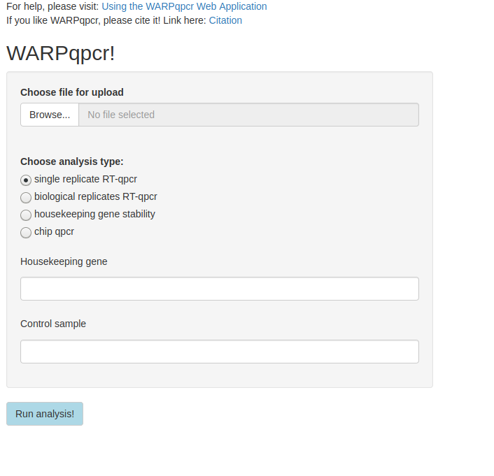
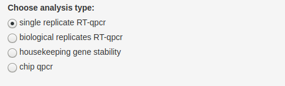
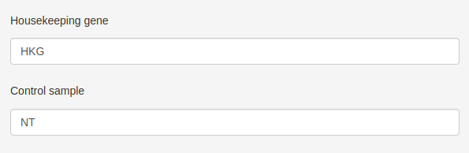
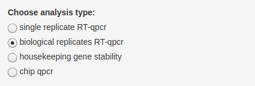
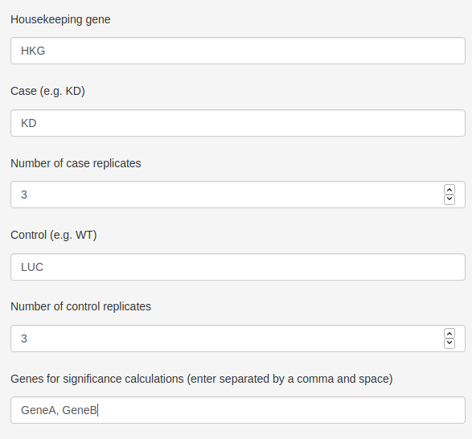
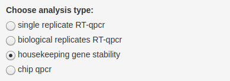
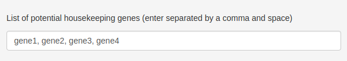
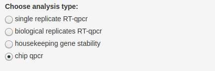
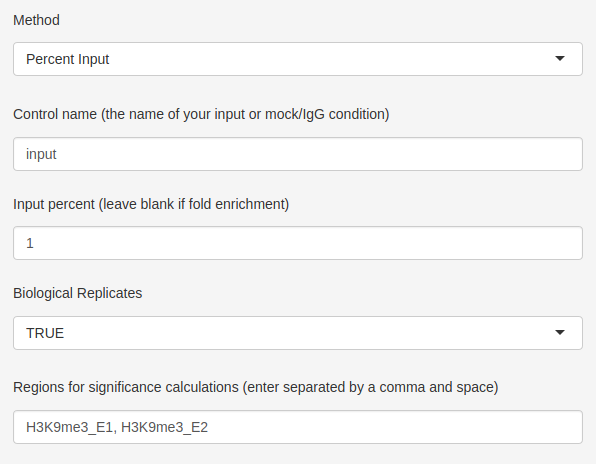

```{r, include = FALSE}
knitr::opts_chunk$set(
  collapse = TRUE,
  comment = "#>"#,
  #fig.path = "man/figures/README-"
)
```


```{r setup, echo=FALSE}
suppressPackageStartupMessages(library(WARPqpcr))
suppressPackageStartupMessages(library(png))
suppressPackageStartupMessages(library(jpeg))
suppressPackageStartupMessages(library(here))
```

## About the Application

[CLICK HERE](https://s-carson-callahan.shinyapps.io/WARPqpcr/) to go to the WARPqpcr Shiny Web Application.

The WARPqpcr Web Application runs the same analysis as the [WARPqpcr R package](https://github.com/sccallahan/WARPqpcr), but is controlled through a point-and-click user interface. The application works through essentially 4 steps:

* Upload a samplesheet (format is described below)

* Choose an anlysis type (single replicate, biological replicates, or housekeeping gene stability)

* Complete required fields (text fields with prompts) and click "Run Analysis!"

* Download data

Upload completion of the analysis, a download button will appear, allowing users to download a .zip file containing all of the analysis outputs.

If you like WARPqpcr, please cite it!
```{r, echo=FALSE}
citation(package = "WARPqpcr")
```

NB: Disconnection from the server after clicking "Run Analysis" is indicative of one or more fields being incorrectly completed - a typo in a condition/gene name is the most common reason.

## Tutorials

Below is a small tutorial for each of the 4 currently available analyses. I will also include a small snippet of the datasheet that is required for each analysis to make the format more clear.

Navigating to the Web Application will show this webpage:

```{r echo=FALSE, out.width = '75%'}

```

Users can then select which analysis they would like to perform!

**NB:** For the single and biological replicate analysis, the coefficient of variation (CV) is calculated and meant to be used as a measure of technical replicate consistency. If the CV of any samples goes above 1%, a warning message will displayed prompting you to go to the raw and average CT values of the analysis and consider removing outliers:


```{r echo=FALSE, out.width = '60%'}
knitr::include_graphics("warning_CV.png")
```


#### Single Replicate Analysis

This mode is only recommended for pilot data or cases where several constructs (shRNA, overexpression, etc.) are being screened for efficiency. No statistics are calculated because there are no biological replicates. While statistics could be computed on this data, I do not feel comfortable recommending that approach, as it is simply measuring the user's pipetting error.

Samplesheet snippet:
```{r, echo=FALSE}
suppressPackageStartupMessages(library(WARPqpcr))

# read in the qPCR data
sampleObj <-read.csv("samplesheet_singleRep.csv", header = TRUE, sep = "\t")

sampleObj[1:20, ]
```

**Step 1: Upload the file!**

```{r echo=FALSE, out.width = '80%'}
knitr::include_graphics("file_upload_image.png")
```

All analyses will start with this step. Simply click the "Browse" button and navigate to your samplesheet.

**Step 2: Choose "single replicate"**

```{r echo=FALSE, out.width = '75%'}

```

**Step 3: Enter Text Fields and Run Analysis!**

```{r echo=FALSE, out.width = '75%', out.height= '100%'}

```

Here, the user enters the requested information, then clicks the "Run Analysis!" button. The "Housekeeping gene" field is where the user inputs the gene to be used as the housekeeping for calculations. Here I have used a generic "HKG" as an example. The "Control sample" is the name of the control in your experiment. In this case, my control was called "NT" in the sameplesheet, so I will enter that here as well. *Do not* place punctuation around the names, simply enter them as text as shown.

**Step 4: Download data.**

Upon completion of analysis, a download button will appear. Click this button to download a .zip file of results called "outputs.zip."

```{r echo=FALSE, out.width = '15%'}
knitr::include_graphics("download_button.png")
```


#### Biolgical Replicate Analysis

Samplesheet snippet:
```{r, echo=FALSE}
suppressPackageStartupMessages(library(WARPqpcr))

# read in the qPCR data
sampleObj <-read.csv("samplesheet_bioReps_2.csv", header = TRUE, sep = "\t")

sampleObj[1:20, ]
```

**Step 1: Upload the file!**

```{r echo=FALSE, out.width = '80%'}
knitr::include_graphics("file_upload_image.png")
```

**Step 2: Choose "biological replicates"**

```{r echo=FALSE, out.width = '75%'}

```

The number of replicates defaults to 3, but this can be changed to match whatever the user has for their data.

**Step 3: Enter Text Fields and Run Analysis!**

```{r echo=FALSE, out.width = '80%', out.height= '100%'}

```

Here, the user enters the requested information, then clicks the "Run Analysis!" button. The "Housekeeping gene" field is where the user inputs the gene to be used as the housekeeping for calculations. As before, I have used a generic "HKG" as an example. Case and Control are where you enter the information for the two groups of your samples ("Case" being the test/experimental condition, "Control" being the control condition). Looking at the samplesheet snippet, my two groups are "KD" and "LUC" (a luciferase control), respectively. If needed, change the number of replicates to match the number of biological replicates you have - I happen to have 3. The last field is where you enter the genes for which statistical tests need to be computed - this is a two-sample T.test using the `t.test` function in R. The genes *must* be entered as shown - i.e. text separated by a comma then a space. Gene names are whatever was entered for the "Detector" field in the samplesheet.

**Step 4: Download data.**

Upon completion of analysis, a download button will appear. Click this button to download a .zip file of results called "outputs.zip."

```{r echo=FALSE, out.width = '15%'}
knitr::include_graphics("download_button.png")
```


#### Housekeeping Gene Stability

This option calculates the stability of genes across conditions. Its intended use is for selecting the most stable potential housekeeping gene from a list of candidates.

Samplesheet snippet:
```{r, echo=FALSE}
suppressPackageStartupMessages(library(WARPqpcr))

# read in the qPCR data
sampleObj <-read.csv("samplesheet_hkgStab.csv", header = TRUE, sep = "\t")

sampleObj[1:20, ]
```


**Step 1: Upload the file!**

```{r echo=FALSE, out.width = '80%'}
knitr::include_graphics("file_upload_image.png")
```

**Step 2: Choose "housekeeping gene stability"**

```{r echo=FALSE, out.width = '75%'}

```

**Step 3: Enter Text Field and Run Analysis!**

```{r echo=FALSE, out.width = '75%'}

```

Here, the user enters the requested information, then clicks the "Run Analysis!" button. Enter the genes that are meant to be compared for stability. As in the biological replicates, the genes *must* be entered as text separated by a comma and space.

**Step 4: Download data.**

Upon completion of analysis, a download button will appear. Click this button to download a .zip file of results called "outputs.zip." For housekeeping gene stability, the contents will be a .txt file containing genes ranked from "most stable" (lowest score) to "least stable" (highest score).

```{r echo=FALSE, out.width = '15%'}
knitr::include_graphics("download_button.png")
```


#### Chip qPCR

This example will be for data with biological replicates using the percent input method. The process for single replicate is very similar, the exception being the "Regions for significance calculations" field should just be left blank. Similarly, fold enrichment calculations can be done by selecting "Fold Enrichment" from the "Method" dropdown menu and leaving the "Input percent" field blank.

Samplesheet snippet:
```{r, echo=FALSE}
suppressPackageStartupMessages(library(WARPqpcr))

# read in the qPCR data
sampleObj <-read.csv("chip_qpcr_samplesheet_bioReps.csv", header = TRUE, sep = "\t")

sampleObj[c(1:6, 49:54), ]
```


**Step 1: Upload the file!**

```{r echo=FALSE, out.width = '80%'}
knitr::include_graphics("file_upload_image.png")
```

**Step 2: Choose "housekeeping gene stability"**

```{r echo=FALSE, out.width = '75%'}

```

**Step 3: Enter Text Field and Run Analysis!**

```{r echo=FALSE, out.width = '75%'}

```

Here, the user enters the requested information, then clicks the "Run Analysis!" button. For biological replicates, the regions *must* be entered as text separated by a comma and space (as in the example).

**Step 4: Download data.**

Upon completion of analysis, a download button will appear. Click this button to download a .zip file of results called "outputs.zip."

```{r echo=FALSE, out.width = '15%'}
knitr::include_graphics("download_button.png")
```

