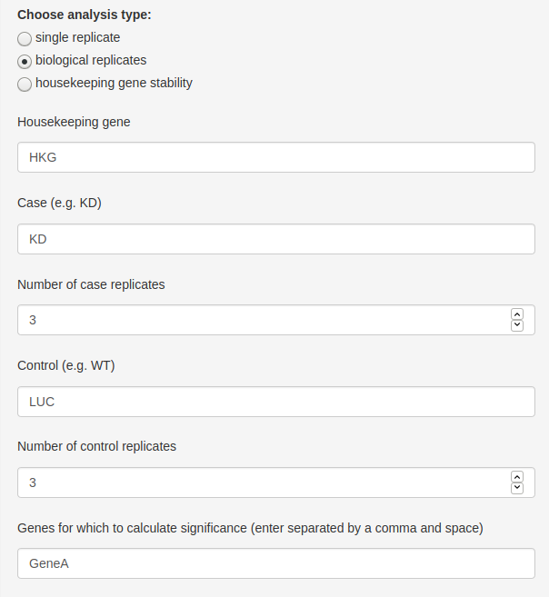
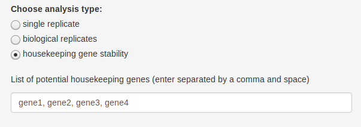

Using the WARPqpcr Web Application
================
S. Carson Callahan
2019-11-23

About the Application
---------------------

[CLICK HERE](https://s-carson-callahan.shinyapps.io/WARPqpcr/) to go to the WARPqpcr Shiny Web Application.

The WARPqpcr Web Application runs the same analysis as the [WARPqpcr R package](https://github.com/sccallahan/WARPqpcr), but is controlled through a point-and-click user interface. The application works through essentially 4 steps:

-   Upload a samplesheet (format is described below)

-   Choose an anlysis type (single replicate, biological replicates, or housekeeping gene stability)

-   Complete required fields (text fields with prompts) and click "Run Analysis!"

-   Download data

Upload completion of the analysis, a download button will appear, allowing users to download a .zip file containing all of the analysis outputs.

Tutorials
---------

Below is a small tutorial for each of the 3 currently available analyses. I will also include a small snippet of the datasheet that is required for each analysis to make the format more clear.

Navigating to the Web Application will show this webpage:

Users can this select which analysis they would like to perform!

**NB:** For the single and biological replicate analysis, the coefficient of variation (CV) is calculated and meant to be used as a measure of technical replicate consistency. If the CV of any samples goes above 1%, a warning message will displayed prompting you to go to the raw and average CT values of the analysis and consider removing outliers:

#### Single Replicate Analysis

This mode is only recommended for pilot data or cases where several constructs (shRNA, overexpression, etc.) are being screened for efficiency. No statistics are calculated because there are no biological replicates. While statistics could be computed on this data, I do not feel comfortable recommending that approach, as it is simply measuring the user's pipetting error.

Samplesheet snippet:

    #>    Well Plate Sample Detector    Cq
    #> 1    A1     1     NT    GeneA 24.70
    #> 2    A2     1    sh1    GeneA 24.98
    #> 3    A3     1    sh3    GeneA 24.84
    #> 4    A4     1    sh5    GeneA 24.45
    #> 5    A5     1    sh6    GeneA 24.34
    #> 6    A6     1     NT      HKG 16.79
    #> 7    A7     1    sh1      HKG 16.78
    #> 8    A8     1    sh3      HKG 17.14
    #> 9    A9     1    sh5      HKG 17.32
    #> 10  A10     1    sh6      HKG 16.97
    #> 11   B1     1     NT    GeneA 24.76
    #> 12   B2     1    sh1    GeneA 24.83
    #> 13   B3     1    sh3    GeneA 24.71
    #> 14   B4     1    sh5    GeneA 24.34
    #> 15   B5     1    sh6    GeneA 24.22
    #> 16   B6     1     NT      HKG 16.79
    #> 17   B7     1    sh1      HKG 16.60
    #> 18   B8     1    sh3      HKG 17.27
    #> 19   B9     1    sh5      HKG 17.20
    #> 20  B10     1    sh6      HKG 17.12

**Step 1: Upload the file!**

All analyses will start with this step. Simply click the "Browse" button and navigate to your samplesheet.

**Step 2: Choose "single replicate"**

**Step 3: Enter Text Fields and Run Analysis!**

Here, the user enters the requested information, then clicks the "Run Analysis!" button. The "Housekeeping gene" field is where the user inputs the gene to be used as the housekeeping for calculations. Here I have used a generic "HKG" as an example. The "Control sample" is the name of the control in your experiment. In this case, my control was called "NT" in the sameplesheet, so I will enter that here as well. *Do not* place punctuation around the names, simply enter them as text as shown.

**Step 4: Download data.**

Upon completion of analysis, a download button will appear. Click this button to download a .zip file of results called "outputs.zip."

#### Biolgical Replicate Analysis

Samplesheet snippet:

    #>    Well Plate Sample Detector    Cq
    #> 1    A4     1  LUC_1    GeneA 25.25
    #> 2    A5     1  LUC_1    GeneA 25.27
    #> 3    A6     1  LUC_1    GeneA 25.48
    #> 4   A10     1   KD_1    GeneA 25.95
    #> 5   A11     1   KD_1    GeneA 25.71
    #> 6   A12     1   KD_1    GeneA 25.76
    #> 7    B4     1  LUC_2    GeneA 25.64
    #> 8    B5     1  LUC_2    GeneA 25.66
    #> 9    B6     1  LUC_2    GeneA 25.62
    #> 10  B10     1   KD_2    GeneA 25.47
    #> 11  B11     1   KD_2    GeneA 25.54
    #> 12  B12     1   KD_2    GeneA 25.44
    #> 13   C4     1  LUC_3    GeneA 25.17
    #> 14   C5     1  LUC_3    GeneA 25.30
    #> 15   C6     1  LUC_3    GeneA 25.16
    #> 16  C10     1   KD_3    GeneA 25.72
    #> 17  C11     1   KD_3    GeneA 25.76
    #> 18  C12     1   KD_3    GeneA 25.77
    #> 19   D4     1  LUC_1      HKG 12.12
    #> 20   D5     1  LUC_1      HKG 12.44

**Step 1: Upload the file!**

**Step 2: Choose "biological replicates"**

The number of replicates defaults to 3, but this can be changed to match whatever the user has for their data.

**Step 3: Enter Text Fields and Run Analysis!**

Here, the user enters the requested information, then clicks the "Run Analysis!" button. The "Housekeeping gene" field is where the user inputs the gene to be used as the housekeeping for calculations. As before, I have used a generic "HKG" as an example. Condition 1 and Condition 2 are where you enter the information for the two groups of your samples. Looking at the samplesheet snippet, my two groups are "KD" and "LUC" (a luciferase control). If needed, change the number of replicates to match the number of biological replicates you have - I happen to have 3. The last field is where you enter the genes for which statistical tests need to be computed - this is a two-sample T.test using the `t.test` function in R. The genes *must* be entered as shown - i.e. text separated by a comma then a space. Gene names are whatever was entered for the "Detector" field in the samplesheet.

**Step 4: Download data.**

Upon completion of analysis, a download button will appear. Click this button to download a .zip file of results called "outputs.zip."

#### Housekeeping Gene Stability

This option calculates the stability of genes across conditions. Its intended use is for selecting the most stable potential housekeeping gene from a list of candidates.

Samplesheet snippet:

    #>    Well Plate Sample Detector       Cq
    #> 1    A1     1     s1    gene1 22.25024
    #> 2    A2     1     s1    gene1 20.11929
    #> 3    A3     1     s1    gene1 21.57987
    #> 4    A4     1     s1    gene2 18.03850
    #> 5    A5     1     s1    gene2 17.71066
    #> 6    A6     1     s1    gene2 17.93536
    #> 7    A7     1     s1    gene3 20.11550
    #> 8    A8     1     s1    gene3 19.13198
    #> 9    A9     1     s1    gene3 19.80609
    #> 10  A10     1     s1    gene4 19.07700
    #> 11   B1     1     s1    gene4 18.42132
    #> 12   B2     1     s1    gene4 18.87073
    #> 13   B3     1     s2    gene1 24.10898
    #> 14   B4     1     s2    gene1 21.10427
    #> 15   B5     1     s2    gene1 24.65476
    #> 16   B6     1     s2    gene2 18.32446
    #> 17   B7     1     s2    gene2 17.86220
    #> 18   B8     1     s2    gene2 18.40842
    #> 19   B9     1     s2    gene3 20.97338
    #> 20  B10     1     s2    gene3 19.58659

**Step 1: Upload the file!**

**Step 2: Choose "housekeeping gene stability"**

**Step 3: Enter Text Field and Run Analysis!**

Here, the user enters the requested information, then clicks the "Run Analysis!" button. Enter the genes that are meant to be compared for stability. As in the biological replicates, the genes *must* be entered as text separated by a comma and space.

**Step 4: Download data.**

Upon completion of analysis, a download button will appear. Click this button to download a .zip file of results called "outputs.zip." For housekeeping gene stability, the contents will be a .txt file containing genes ranked from "most stable" (lowest score) to "least stable" (highest score).

